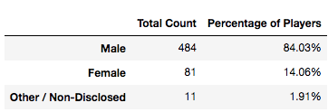
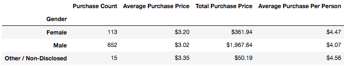
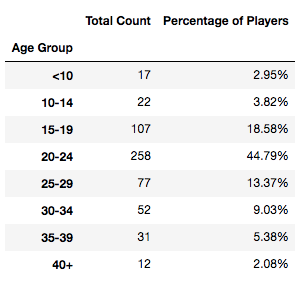
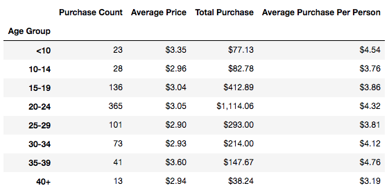
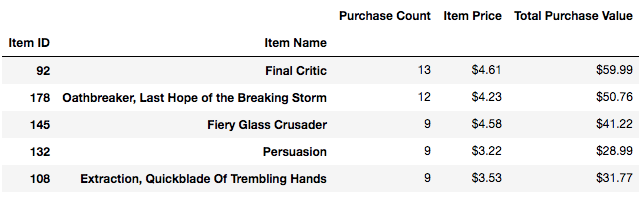

# Pandas Homework - Pandas, Pandas, Pandas

## Background

Congratulations! After a lot of hard work in the data munging mines, you've landed a job as Lead Analyst for an independent gaming company. You've been assigned the task of analyzing the data for their most recent fantasy game Heroes of Pymoli.

Like many others in its genre, the game is free-to-play, but players are encouraged to purchase optional items that enhance their playing experience. As a first task, the company would like you to generate a report that breaks down the game's purchasing data into meaningful insights.

## Final report includes the following:

### Player Count

* Total Number of Players

### Purchasing Analysis (Total)

* Number of Unique Items
* Average Purchase Price
* Total Number of Purchases
* Total Revenue

### Gender Demographics

* Percentage and Count of Male Players
* Percentage and Count of Female Players
* Percentage and Count of Other / Non-Disclosed

### Purchasing Analysis (Gender)

* The below each broken by gender
  * Purchase Count
  * Average Purchase Price
  * Total Purchase Value
  * Average Purchase Total per Person by Gender

### Age Demographics

* The below each broken into bins of 4 years (i.e. &lt;10, 10-14, 15-19, etc.)
  * Purchase Count
  * Average Purchase Price
  * Total Purchase Value
  * Average Purchase Total per Person by Age Group

### Top Spenders

* Identify the the top 5 spenders in the game by total purchase value, then list (in a table):
  * SN
  * Purchase Count
  * Average Purchase Price
  * Total Purchase Value

### Most Popular Items

* Identify the 5 most popular items by purchase count, then list (in a table):
  * Item ID
  * Item Name
  * Purchase Count
  * Item Price
  * Total Purchase Value

### Most Profitable Items

* Identify the 5 most profitable items by total purchase value, then list (in a table):
  * Item ID
  * Item Name
  * Purchase Count
  * Item Price
  * Total Purchase Value

## Observable Trends

  1.	Among 571 players, 84% are males. However,they spent the least per person: they spent, on average, 40 cents less than females, and 49 cents less than other/Non-Disclosed group.

	2.	The largest counts of purchases (365 out of 780 purchases) were made by the 20-24 age group, which makes up 45% of the players. The total revenue generated from this age group was $1114.06. However, the average purchase per person was still lower than other two age groups, and this indicates that they bought the cheaper items on average.

	3.	Looking into item by item, the most popular one was Final Critic, of which 13 purchases were made. Its average price was the highest at $4.61, and, at the same time, it generated the highest profits of $59.99.